                      专业：微电子学              姓名：齐矗曦、雷鸣、吴江                 学号：

**原创性声明**
 
 $\qquad $本报告的内容由本人独立完成,有关观点、方法、数据和文献等的引用已经在文中指出。除文中已经注明引用的内容外,本报告不包含任何其他个人或集体已经公开发表的作品或成果,不存在剽窃、抄袭行为。

# 实验名称：多路抢答器

## 一、实验目的和要求

$\qquad $ 设计一个多路抢答器具体要求如下：

$\qquad $ (1). 抢答组数为8组，每组编号为0、1、2、3、4、5、6、7,每组有一个抢答开关，用按键$ S_0 $~$ S_7 $ 实现，按键编号和每组编号分别一一对应。

$\qquad $ (2). 抢答器具有数据锁存和显示功能。抢答开始后，若有有选手抢答，则该组选手编号立即锁存并予以LED显示，同时封锁其他组的输入使其他按键失去作用。

$\qquad $ (3). 设有外部控制开关，用来将LED显示器清零和解锁所有抢答键，以开始新一轮抢答。

$\qquad $ (4). 抢答器具有定时抢答功能，定时抢答时间为30s。当抢答开始后，定时器开始减法计数，此时扬声器配合减法计数发出声响，持续0.5s左右。若定时时间到，无人抢答，则本次抢答无效，系统报警提示本轮抢答结束；若定时时间内有选手抢答，则定时器停止工作，LED显示器显示本轮答题者编号。

## 二、实验设计原理和内容

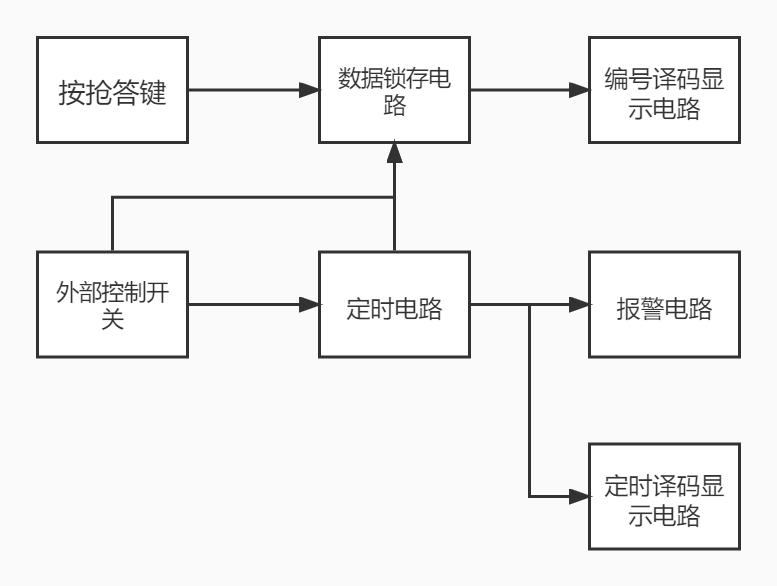

### 抢答、锁存和显示的实现
* 所用芯片：74LS148、74LS279、74LS48、共阴极数码管、开关若干、电阻若干。
* 74LS148：实现抢答，输出编码信号给锁存器给后续译码器。
  * 74LS148真值表
  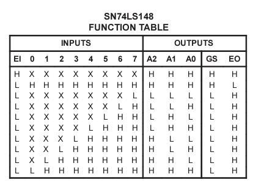
* 74LS279: 接收编码信号，通过反馈将148停止工作，像译码器传递编码信号。
  * 74LS279真值表
  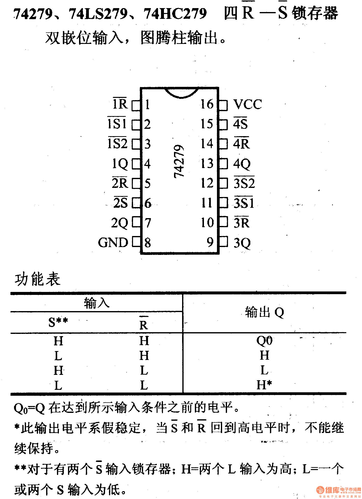
* 74LS48：接收编码信号，在数码管上显示。
  * 74LS48真值表
  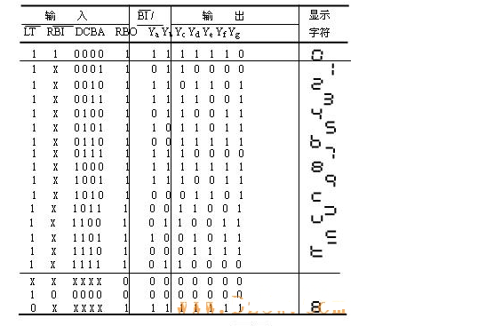
* 锁存的实现：在三位编码信号输出到锁存器的同时将GS也传输给锁存器将Q4传输给EI从而使148停止工作。
  | EI | 输入 $ S_i $ | 输出Gs |  输出 $ Q_4 $ | $ EI^* $ |148工作状态|
  |--- | --- | --- | --- | --- |---|
  |0   |1    |1    |0    |0    |能工作但没有低电平信号输出|
  |0   |0    |0    |1    |1    |148停止工作|

### 外部控制电路
* 所用器件：若干开关电阻
* 实现：通过控制279 R端电平高低，控制LED灭零和锁存器工作状态

### 抢答部分电路图
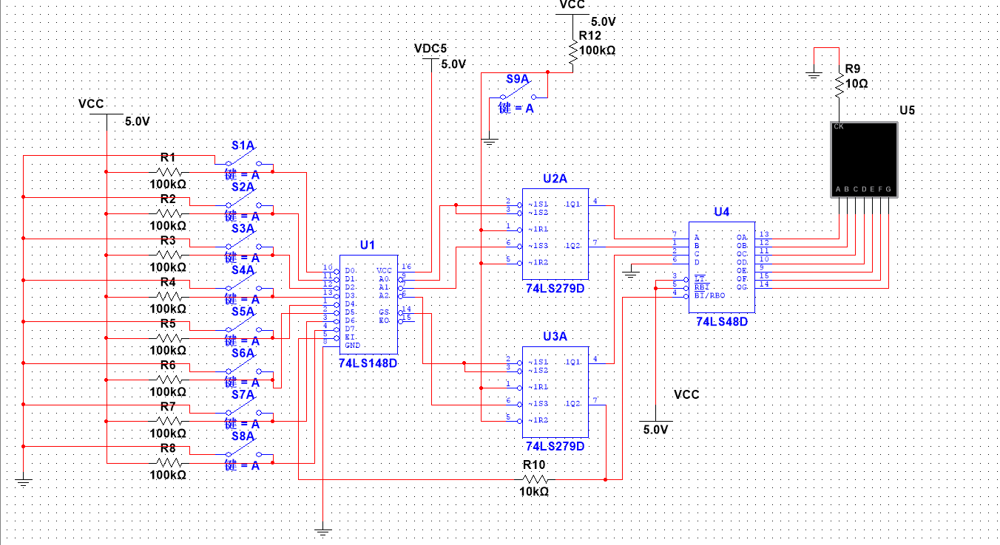

### 倒计时电路
* 所用芯片：74LS192、74LS48、74LS279、74LS02

* 实现原理：设置电平实现预置数，将低位计数器的借位输出作为高位的CLK，由抢答部分控制计时器工作与否

* 74LS192：
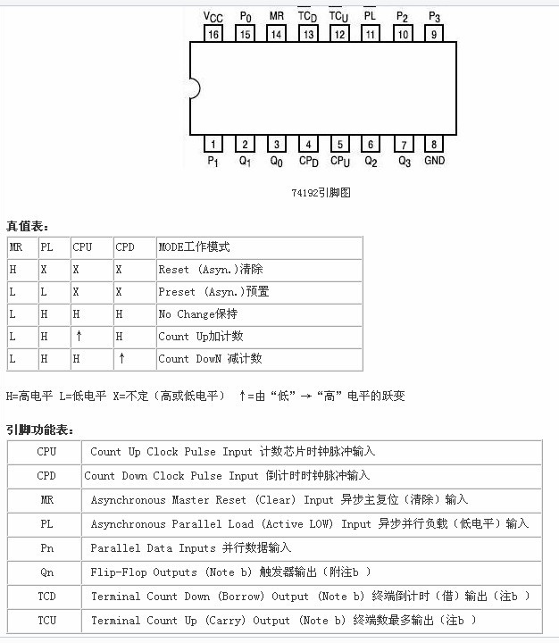

### 总体电路

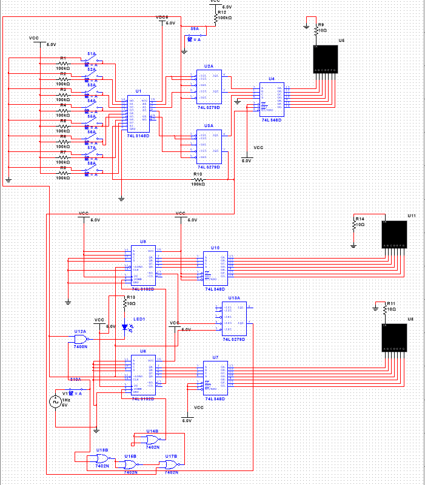

## 三、实验结果

* 抢答功能展示：
  
  * 编号为3的选手抢答：
    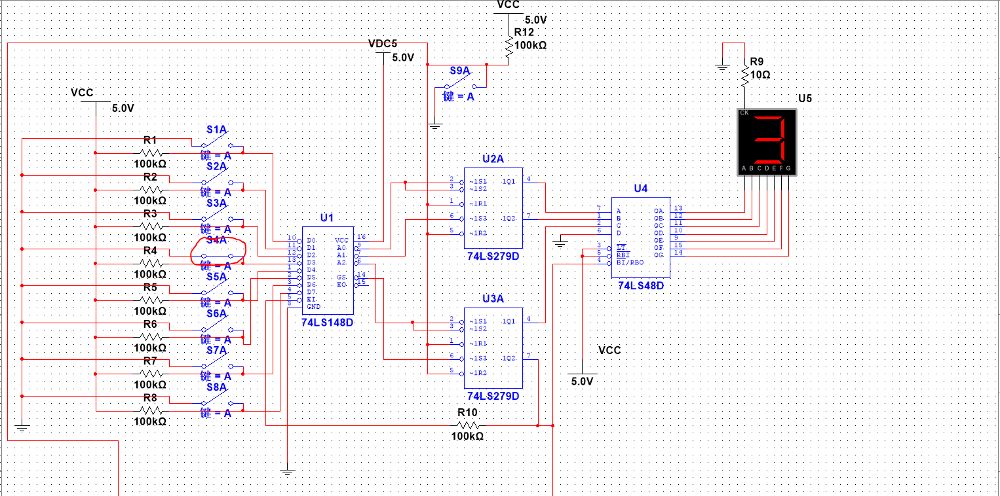
  
  * 此时编号为6的选手稍后按键
   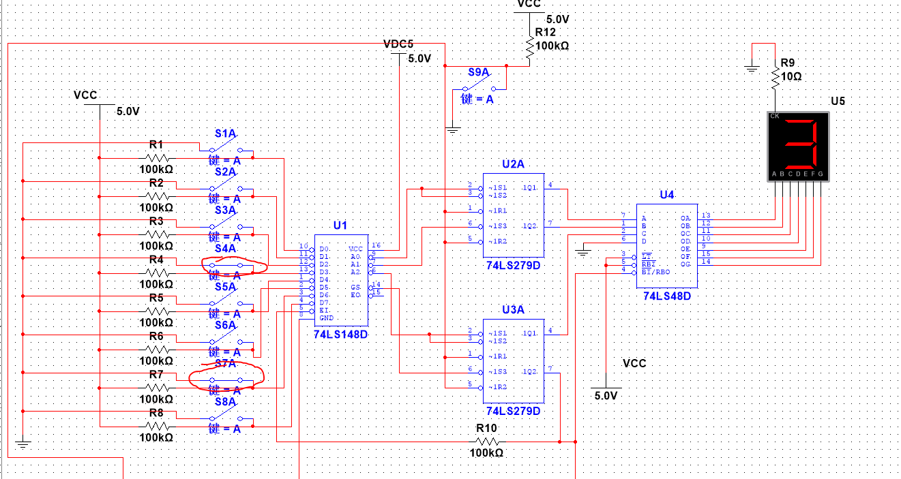

  * 倒计时展示
   * 未抢答时 
   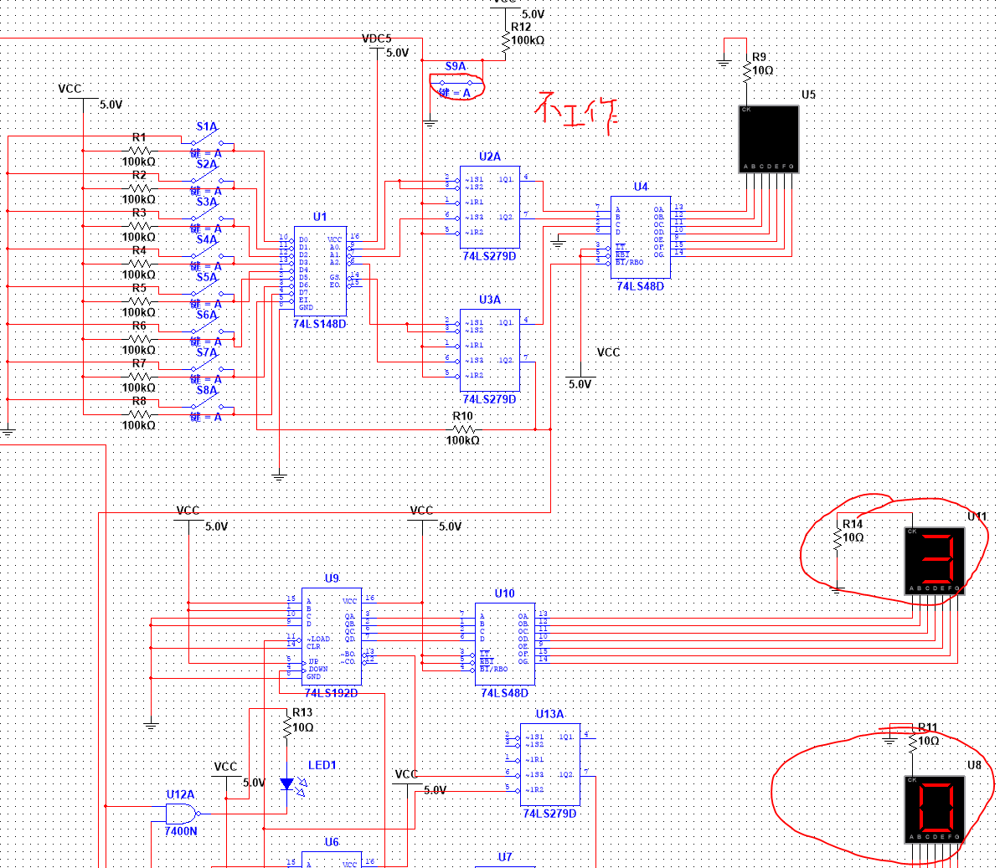 
   
   * 开始抢答但还未有选手抢答
   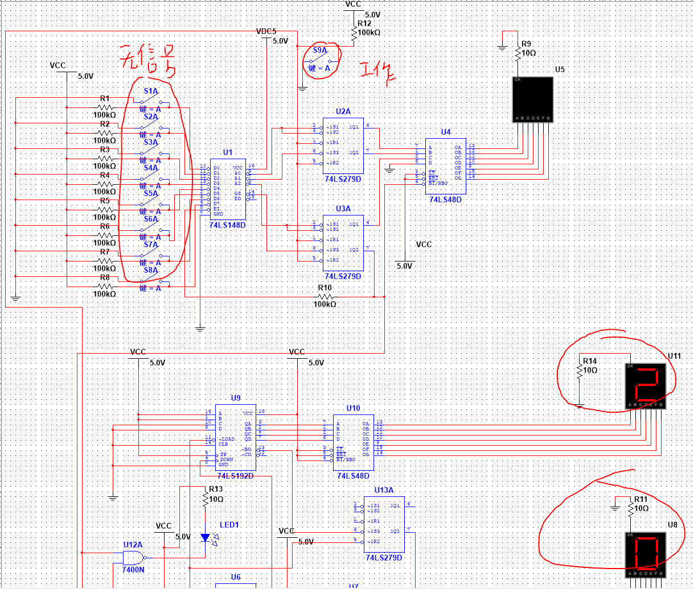  

   * 有选手在30s内抢答
   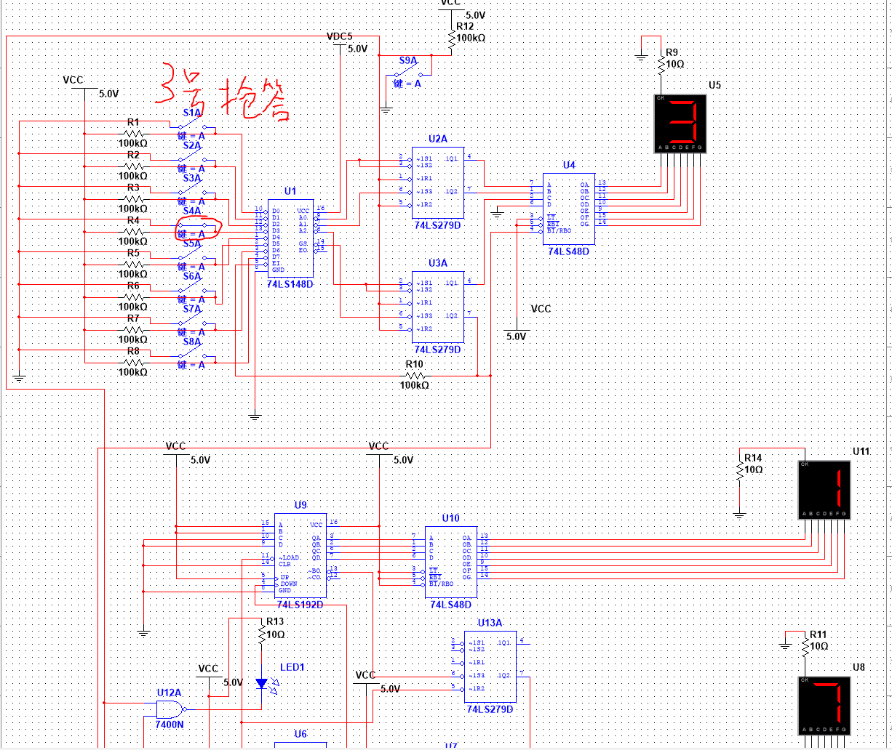

## 四、分析讨论
1. 若抢答器每组编号分别为1、2、3、4、5、6、7、8如何实现
   
   倒计时电路不变，抢答电路做改变：
   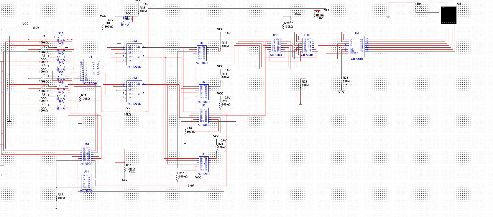

2. 方案有何不足？
   
   抢答结束后清零过程比较复杂，需要先将输入信号清除，再将主持人开关复位，否则电路下一次抢答时电平不稳定。第二点，倒计时结束后显示99，实际电路理想应该是灭零或者回到30.
   