# Metal-Oxide-Semiconductor Fields Effect Transistor

# 5.1 单极型晶体管

## 5.1 基本介绍

单极型晶体管**只利用电子（或者空穴）作为载流子进行导电**。双极型晶体管依靠注入少数载流子进行电导调制；而**单极型晶体管大多靠电场（电压）进行调制（控制多数载流子）**

* 优点：**没有少子的存储效应，可以制成开关器件（高速器件）**

* 种类：场效应管
$$
\begin{cases}
MOSFET：栅极由金属—绝缘膜——半导体等多层结构组成时称为MISFET，绝缘为氧化膜时称为MOSFET。\\
JFET：栅极由pn结构成\\
MESFET：栅极由肖特基结构成\\
\end{cases}
$$

* **沟道**：栅极下的半导体区域。控制的是电子流时称为n沟道，控制空穴是称为p沟道。栅极电压为0时，DS之间由电流流动称为常通型（耗尽型depletion mode）；没有电流流动时称为常断型（增强型 enhancement mode）

# 5.2 MOS结构

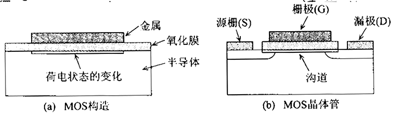
在栅极与半导体之间施加电压时，由于电场效应使半导体表面带电状态即电导率发生变化。

## 5.2.1 MOS电容

**理想MOS假设：**
1. 金属和半导体的费米能级一致；
2. 氧化膜中不存在固定电荷
3. 氧化膜和半导体界面不存在界面能级
4. 氧化膜中无电流流动

理想条件下，栅极电压为0时，半导体处于平带状态;当栅极有偏置电压时，半导体表面带电会有四种状态：**积累、平带、耗尽、反型**

### 半导体表面四种状态
* **积累**
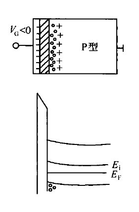

栅极施加负电压，p型衬底内的多数载流子——**空穴被吸引到半导体表面**。在导体表面积累了过剩多数载流子。因此是积累

* **平带**
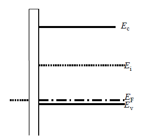

* **耗尽**
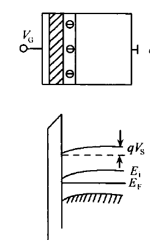
栅极施加正偏压，**空穴从表面从表面向内部移动**，空穴浓度逐渐减小，最后没有空穴称为**耗尽**状态

* **反型**
继续增大栅极电压，耗尽层厚度增加，半导体内部的电子来到表面，形成与p型衬底相反的n型反型层。
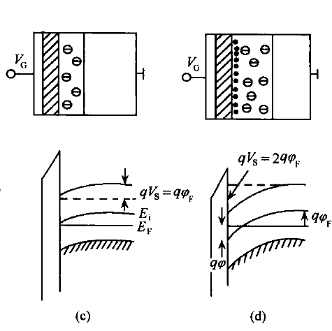

### MOS等效电路
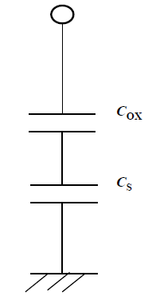
$ C_{OX} $ 氧化物膜电容
$ C_{S} $  半导体耗尽层电容 

* $ C-V特性 $
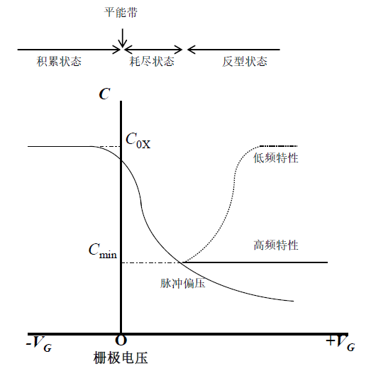
假设耗尽层两侧施加的电压为$ V_{dep} $,半导体的杂志浓度为 $ N_A $,则耗尽层的厚度 $ h_d $ 为
$$
h_d=\displaystyle\left(\frac{2\varepsilon V_{dep}}{qN_A} \right)^{\frac{1}{2}}
$$

## 5.2.2 MOS界面生成的电子及空穴浓度

### 表面层压降和费米势：
  
  * **$ \phi_S $** : 描述半导体表面能带的弯曲程度，也是表面层压降 **$ \phi_S=(E_{i0}-E_{iS})/q $**
  * **$ \phi_F $** : 费米势，是半导体内部本征费米能级和费米能级之差，**$ \phi_F=(E_{i0}-E_F)/q $**

### p型半导体表面的空穴浓度 

 * **$ p_S =\displaystyle N_A\,exp\left(-q\phi_S/k_BT\right) $**
  
  推导如下：$ p_s=n_iexp(\frac{E_{is}-E_F}{K_BT})=n_iexp(\frac{E_{is}-E_{i0}+E_{i0}-E_F}{k_BT})=n_0exp(-q\phi_S/k_BT)且平衡时n_0=N_A $ 

### 表面电子浓度$ n_s $为：

* **$ n_s=\displaystyle n_i\,exp\left( \frac{E_F-E_{iS}}{k_BT} \right)=ni\,exp\left(\frac{E_F-E_{i0}+E_{i0}-E_{iS}}{k_BT}\right)=n_i\,exp\left(\frac{-q(\phi_F -\phi_S)}{k_BT}\right) $,也等于$ \displaystyle n_i^2\,exp\left(\frac{q\phi_S}{k_BT}\right)/N_A $**

### $ \phi_S 与表面载流子浓度关系$

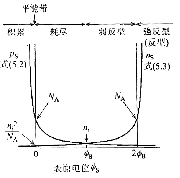

## 5.2.3 平带电压

* 理想MOS二极管，当栅极电压为零时，能带为平带状态。实际MOS管中，由于金属和半导体功函数不同，在接触前两者的$ E_F $ 不一样，在接触后，产生能带的弯曲，直到形成统一的费米能级。
  
* 能带的弯曲和 $ 功函数差  \phi_{ms},界面能级（氧化膜和半导体界面）中的电荷Q_{it},栅极氧化膜中存在的电荷Q_{ox} 有关 $,若想拉平能带必须施加电压，即$ V_{FB} $
  
* $ V_{FB}= \phi_{ms}-Q_{ox}/C_{ox} $

* $ \phi_{ms}=\phi_m-(\chi_S+E_g/2+\phi_F) $

* $ Q_{ox}= \displaystyle \int_0^{T_{ox}}x/T_{ox}\rho_{ox}(x){\rm d}x $

# 5.3 MOSFET的结构及工作原理

## 5.3.1 MOSFET基本结构

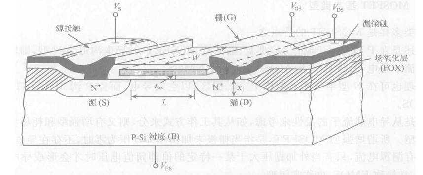

## 5.3.2 MOSEFET 基本类型

根据载流子工作类型不同分为n型和p型，n型生成n沟道，p型生成p沟道；根据工作类型分为增强型/常闭型（EMOS）和耗尽型/常通型（DMOS），EMOS即没有栅极电压时不形成导电沟道，DMOS即不施加栅极电压时也有导电沟道：实际的MOSFET金属和半导体功函数存在差值，不施加电压时，半导体表面能带也发生弯曲，当栅极氧化膜电荷密度较大，而P型衬底掺杂浓度较低，很容易在没有偏置电压的情况下形成N型反型层。

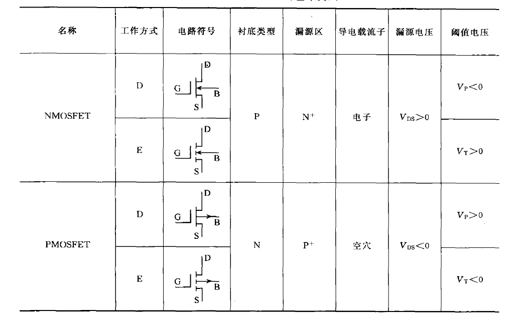

## 5.3.3 MOSFET基本工作原理

基于半导体的表面场效应，让栅极电压控制沟道电导。

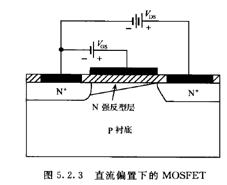

固定 $ V_{DS} $, $ V_{GS} $越大导电沟道越厚，沟道电导越大，$ I_{DS} $ 越大。

### 沟道电导 

**$\displaystyle g =\frac{W}{L}\mu_n |Q_n| $** （W为沟道宽度，L为沟道长度，$u_n$ 为反型区电子迁移率，$|Q_n|$ 为沟道单位面积电荷量。

## 5.3.4 MOSFET的转移特性

转移特性即栅极电压$V_{GS}$和漏极电流$I_{DS}$的关系.

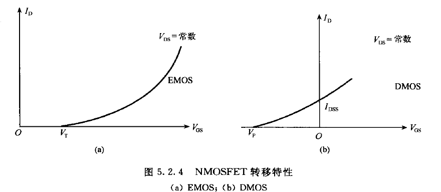

## 5.3.5 MOSFET的输出特性

即在不同栅极电压$V_{GS}$下，漏源电压$V_{DS}$和漏极电流$I_{DS}$的关系.

### 输出特性曲线

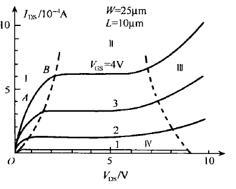

可以分为四个区域分析
$(1)非饱和区，(2)饱和区，(3)雪崩区，(4)截至区$

### 半导体表面电位

在分析工作区前需要讨论半导体表面电位，在共源连接下，半导体表面的电势来源于两部分一个是竖直方向的栅源电压$V_{GS}$带来的电势，一个是水平方向的漏源电压$V_{DS}$带来的电势，而每一点的电势决定了这一点是否反型。

* $V_{y}(x)=V_{GS}-V_x(x)，决定了该位置反型层厚薄$ 

### 工作区分析

* 非饱和区（$V_{DS}<V_{DSat}）$
  
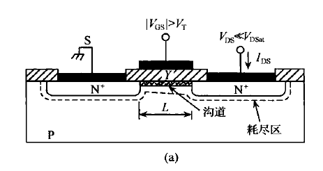

可以分成两段第一段源漏压降较小，虽然沟道两端有压降，但是可以忽略，因此沟道的电子浓度均匀相当于固定阻值的电阻，另一段源漏压降不能忽略，所以沟道厚度不均匀，从源到漏逐渐变薄，电阻随着$V_{DS}$增大，此段电阻可调。

* 饱和区

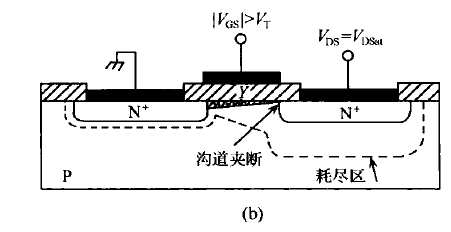
$V_{DS}=V_{DSat}时，$ 沟道在漏极处夹断，此处沟道厚度为0，$I_{DS}$达到饱和。

* 雪崩区

即第三段,$V_{DS}\ge V_{DSat},漏源电压V_{DS}使得漏衬PN结反偏,当到达PN结的击穿电压时,漏源电流急剧增加 $

* 截止区

栅源电压小于开启电压,漏源电流很小.

# MOSFET的阈值电压

## 5.3.1 阈值电压的含义

* 使栅下半导体表面出现强反型形成沟道时的的栅源电压. $V_T$

强反型对应,$V_S=2\phi_F $,即表面积累的少子浓度大于等于体内多子浓度.

* 此时有 $V_S=2\phi_F=\displaystyle\frac{2kT}{q}\ln{\frac{N_A}{n_i}}$

需要注意的是,强反型一旦出现,沟道的电子浓度俺指数规律急剧增加,所以对外电压有屏蔽作用,使之不能进入半导体内部,故强反型层出现后,耗尽层宽度达到最大值而不再增加.由于强反型时,反型层厚度很薄,远小于耗尽层厚度,**所以近似认为表面面势主要降落在耗尽层上**

### 耗尽层厚度

通过上述分析可以计算出耗尽层的厚度$x_{dm}$

$\displaystyle \nabla \cdot E=\frac{\rho}{\varepsilon}==>\frac{\rm d^2V}{\rm dx^2}=\frac{qN_A}{\varepsilon}\Rightarrow x_{dm}=\sqrt{\frac{2\varepsilon_0 \varepsilon_sV_S}{qN_A}}$ 

### 耗尽层电荷密度

此时耗尽层电荷密度也达到最大值

* $\displaystyle Q_{BM}=-qN_Ax_{dm}=-\sqrt{2\varepsilon_0 \varepsilon_SqN_A}$

栅电压继续增加,主要是导致反型层沟道电荷的增加.

## 5.3.2 平带电压

* $\displaystyle V_{FB}= \phi_{ms}-Q_{ox}/C_{ox} $

* $\displaystyle \phi_{ms}=\phi_m-(\chi_S+E_g/2+\phi_F) $

金_半接触---存在功函数差$\phi_{ms}$;氧化物层中存在固有电荷$Q_{ox}$.

## 5.3.3 实际MOS结构中的电荷分布

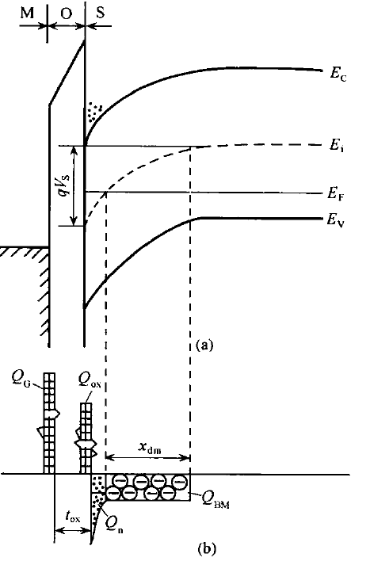
$Q_{G}:栅极极板上的面电荷密度,来源于外加偏压,为正$

$Q_{ox}:绝缘栅氧化层中的面电荷密度,是固有电荷,为正$

$Q_{n}:反型层中的面电和密度,为负$

$Q_{BM}:耗尽层中的面电荷密度,为负$

当我们讨论阈值电压时,$Q_n远小于Q_{BM}$所以忽略不计,由电中性条件:$Q_G+Q_{ox}+Q_{BM}=0$

## 5.3.4 阈值电压表达式

在忽略金-半接触的功函数差和氧化层固有电荷的影响下,外加栅压会降落在氧化层和半导体表面:
   
 即 **$V_{GS}=V_{ox}+V_S$**

其中,**$V_S=2\phi_F,V_{ox}=\displaystyle\frac{Q_G}{C_{ox}}$**

而 **$Q_G+Q_{BM}=0且Q_{BM}=-qN_Ax_{dm}$**

**$V_{T}=2\varphi_F-Q_{BM}/C_{ox}$**

而在实际情况中需要考虑**功函数差和氧化层固有电荷**的影响,所以实际的
**$V_T=2\phi_F-Q_{BM}/C_{ox}-Q_{ox}/C_{oc}+\phi_{ms}$**,相当于理想值加上平带电压.

# 5.4 MOSFET的直流特性

## 5.4.1 Sah方程

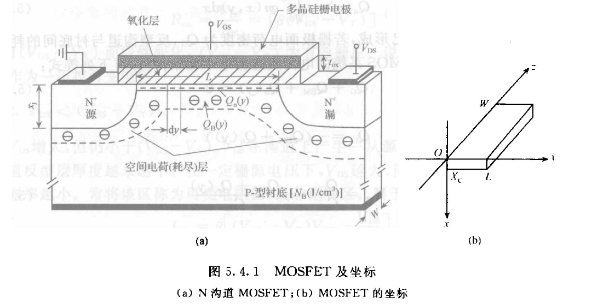

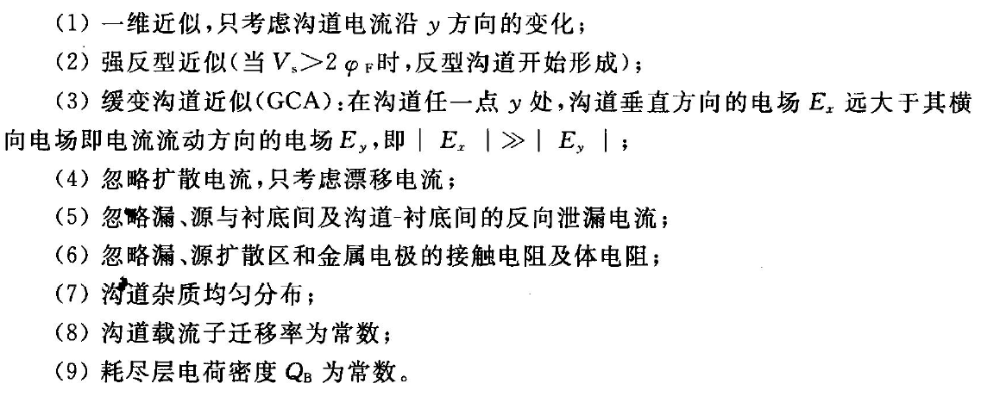

设外加栅压为$V_{GS},且大于V_T,则外加电压V_{DS}全部降落在沟道上$,考虑漂移电流,设沟道内某点电子密度为n(x,y)

**$J_y(x,y)=q\mu_nn(x,y)E_y,为沟道内(x,y)的电流密度则x-z面电流为I_y=\displaystyle \int_0^W\int_0^{X_C}\left[q\mu_nn(x,y)E_y\right]\rm dz\rm dx=\mu_nW\frac{\rm dV(y)}{\rm dy}\int_0^{X_C}-qn(x,y)\rm dx=\mu_nW\frac{\rm dV(y)}{\rm dy}Q_n(y),其中Q_n则为反型层的单位y-z截面的电荷量,对于n沟道器件,该值为负$**

而 **$由电中性条件:Q_G+Q_{BM}+Q_n(y)=0$**

同时,外加栅电压降落在MOS结构上 **$V_{GS}=2\phi_F+V_{ox}+V_{FB}+V(y)=2\phi_F-Q_{BM}/C_{ox}+V_{FB}-Q_n(y)/C_{ox}+V(y)\Rightarrow Q_n(y)=-C_{ox}\left[V_{GS}-(2\phi_F-Q_{BM}/C_{ox}+V_{FB})-V(y) \right]=-C_{ox}[V_{GS}-V_T-V(y)]$**

得到:**$I_y\rm dy=-\mu_nWC_{ox}[V_{GS}-V_T-V(y)]\rm dV(y),同时注意到沟道内电流在y的正方向上为负,所以有-I_{DS}L=\int_0^L \rm dy$**

### 直流特性方程

**$\displaystyle I_{DS}=\frac{\mu_nWC_{ox}}{L}[(V_{GS}-V_T)V_{DS}-\frac{1}{2}V_{DS}^2],其中令\beta =\frac{\mu_nWC_{ox}}{L},称为几何跨导因子.$**

### 特性分析

(1)  $V_{DS}\ll V_{GS}-V_T$

  此时平方项可以忽略:$I_{DS}=\beta (V_{GS}-V_T)V_{DS},此时有R_{on}=[\beta (V_{GS}-V_T)]^{-1}$ ,相当于电阻固定.

(2)  $V_{DS}< V_{GS}-V_T$

  电阻可变

(3) $V_{DS}\ge  V_{GS}-V_T$

将$V_{DS}=V_{GS}-V_T代入,得到I_{DSat}=\frac{\beta}{2}(V_{GS}-V_T)^2称为饱和漏源电流,V_{DSat}=V_{GS}-V_T称为饱和漏源电压$

